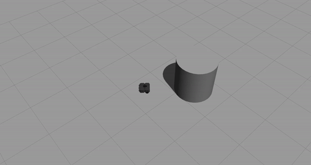

# CMSC 206 Warmup Project Writeup

## Part 1: Driving in a Square.
#### High-Level Approach
For this section of the project, the code proved to relatively straightforward, aside from the challenge of turning 90 degrees. Originally, I intended to utilize the odometer built into the turtle, as such a sensor would accurately keep track of the robot's turning position. However, I eventually decided to simply turn for a specific amount of time, as will be discussed shortly. Once a simple way of turning and moving the robot was implemented, the behavior was only a matter of alternating between straight movement and LH turns in a loop.
#### Code Structure
The structure of "move_in_square.py" is somewhat similar to the object oriented files developed during lecture two of class. It consists of a primary class, titled ROS, which contains the entire behavior of the robot. The program utilizes a single publisher on topic cmd_vel, and has no subscribers.

The run() function of ROS consists primarily of a loop, which alternates between sleeping (via rospy.sleep()) and moving (via a custom function named move().) The move() function in ROS takes two Vector3 arguments and simply publishes new Twist arguments (position and rotation respectively) to the cmd_vel topic.
#### Gif of Behavior

(I'll make it a little smaller next time.)
#### Challenges
As mentioned previously, the largest challenge faced in the program was reliably turning 90 degrees so to make a square pattern. However, this matter was somewhat simplified upon the discovery that the robot's rotational velocity is given in radians per second. Therefore, rotating pi/2 radians could be done by setting the z-axis rotational velocity to pi/2/x, where x is the duration of the turn. Ideally, x should be high to minimize the time spent accelerating by the robot.

Another problem faced during this section of the project was the "skidding" of the robot whenever it stopped to turn. Initially, my turn command set the linear velocity of the robot to 0 before increasing its rotational velocity. However, this sudden brake and turn proved to be unreliable, and could cause the robot to turn too much or too little. To solve this matter, I ensured that the linear x velocity remained constant throughout the behavior, resulting in wider, but more accurate turns.
## Part 2: Following a Wall.
#### High-Level Approach
For this behavior, I elected to use proportional control for the sake of maintaining a given distance from the wall on the robot's right. Proportional control is useful as it is straightforward and easy to fine-tune. As this behavior is relatively simple, I decided against the use of PID control. As for the error being analyzed, the range given by the Lidar's 330-degree range was utilized (30 degrees clockwise from the robot's front.) This range provides a decent compromise between measuring distance from the wall, and forward obstacle detection. Ultimately, this proportional control was utilized for turning the robot along the z axis.
#### Code Structure
The code for this behavior was very similar to lecture 3's line-following algorithm. However, instead of the turtle's camera, the Lidar was used, instead. While a Lidar is not designed to differentiate color, it is incredibly useful for procuring the range of objects surrounding the robot, making it the ideal sensor for this behavior.

The script utilized one subscriber (to /scan) and one publisher (to /cmd_vel). These topics provided the script with its range data and allowed the script to send velocity commands respectively. Whenever a message is sent via the scan topic, the Follower class of this behavior runs the method lidar_check(). This method checks the range returned from the 330th index. The reasoning for this specific range will be explained shortly. Finally, using the error between the returned range and a static target range, the behavior controls the z-axis angular velocity via proportional control.
#### Gif of Behavior

#### Challenges
The main problem faced while implementing was overcoming sharp bends in the wall being followed. For instance, the corners of the square room (both inside and outside of the square.) While the lidar must be used to find the robot's distance from the wall, it must also be used to detect sudden turns or obstacles in front of the robot. After some experimentation, I decided to check the range that extends 30 degrees outwards from the front. This angle provides sufficient forward detection for overcoming sharp corners, while still maintaining a steady distance from the wall to its right. However, this implementation does cause the robot to take very tight right hand turns (as it stops detecting the wall in front of the robot.)

## Part 3: Following a person/object.
#### High-Level Approach
Like the previous behavior, this script utilizes the Lidar to maintain a specific distance from an object. However, unlike the wall follower, this behavior must also ensure that the robot is facing the object closest to it. To this end, two proportional controls are required. One control is for the linear x velocity, and another for the angular z. This way, both the position and rotation of the robot can be properly controlled.

#### Code Structure
This code is built off of the behavior created in wall_follower.py. It utilizes the same publishers, subscribers, and method names. However, the content of lidar_check() itself has been changed. This method now monitors two aspects of the robot's surroundings: the distance and angle from the nearest object. After some adjustments to maximum and minimum values, the code runs two proportional controls on the linear x and angular z velocities respectively. This allows the robot to face the closest object as well as drive to a target distance in front of it.

#### Gif of Behavior

#### Challenges
While this code was largely a modification of the previous behavior, it still came with its own challenges. The most notable of these challenges was obtaining the minimum distances and angles. As the Lidar has its own minimum and maximum ranges, measurements outside of this range needed to be omitted. Keeping this in mind, finding these values was a matter of finding the minimum valid value (and the index at which it occurs) in the msg.ranges array. At this point, the only remaining challenge was finding ideal proportional control constants to ensure smooth movement in the robot.

#### Future Improvements
In the future, I would like to utilize the odometer to increase the precision of my robots linear and rotational movements. While I was able to gain some understanding of how the odometer transfers data to the odom topic, the process was simply too time consuming for this project. Namely, the move_in_square behavior would need to collect the z-axis rotational position of the robot, convert it into radians (inverse sine function?) and calculate the new target position for after the turn. Still, I expect that the odometer will play a critical role in future projects.

Furthermore, I would like to implement PID control into my behaviors in an efficient manner. While these behaviors did not require PID control, the more advanced error calculation could have provided a faster and more responsive robot. Perhaps the creation of a PID class will prove useful in the future.

#### Key Takeaways
As the name "warmup_project" implies, I am still getting used to the ROS process and the interactions between simulator and code. In a way, this project is a lesson on the more fundamental aspects of ROS.
